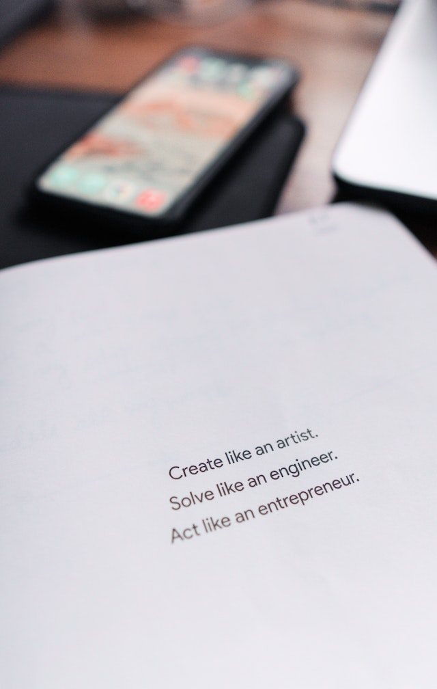

# Do you want to get AWS Certified in 2 weeks? If so, this repo is for you!

Good Luck with the AWS Cloud Practitioner Certification Exam! 

I passed the AWS CCP on October 21, 2023, with 15 days of review and without spending any money other than the exam 
cost. I 
developed these notes for those who are trying to get into Cloud. If you're on github and looking for this type of content - that's great!

This is a good certification because it is the only one where you can learn about most AWS offerings. "AWS has over 200 fully featured services for a wide range of technologies, industries, and use cases.". Cloud is an essential component of digital transformation. Speed to market is improved while lowering TCO via multi-tenancy.  There are various whitepapers, but the AWS Services Overview whitepaper is about 84 pages. You can learn about AWS Global Infrastructure, such as the new _AWS Wavelength_ and _Local Zones_. There are many unique services that AWS has developed over the past few years, and this exam has been refreshed because of it: "It's basically your fault" - CTO, Amazon. You learn about the _Well Architected Framework_ and the various 'lenses' offered with a defined focus. I am particularly interested in exploring the serverless lens. Do you know the difference between Inspector and GuardDuty? Did you know AWS Systems Manager can deploy OS and software patches across many EC2 instances? Did you know Control Tower can centrally govern and enforce the best use of AWS services across all your accounts? That AWS provides a Pricing Calculator for estimates of your workload by region? That Personal Health Dashboard can alert you to events that impact your AWS environment?
## AWS Cloud Practioner Certification CLF-C01 Prep Notes 2023

This repository contains various resources to help pass the AWS Cloud Practioner Certification. The goal is to get certified in 2 weeks of effort or less.

## Resources

1. [AWS Certified Cloud Practioner](https://aws.amazon.com/certification/certified-cloud-practitioner/) AWS Homepage for CPC certification. Download sample questions and the exam guide. 
1. [AWS Web Services Overiew](https://docs.aws.amazon.com/whitepapers/latest/aws-overview/introduction.html?did=wp_card&trk=wp_card) : Whitepaper that describes the full offering from AWS. This is an important paper to read and remember before the test.
1. [Crushing the aws ccp exam](https://www.capitalone.com/tech/cloud/crushing-the-aws-ccp-exam/) An amazing article on `crushing the aws cpc exam` recommended resources linked.
    1. [“Training Notes 2021” by Neal Davis:](https://www.amazon.com/Certified-Cloud-Practitioner-Training-Notes/dp/1073015513/ref=sr_1_3?dchild=1&keywords=aws+certified+cloud+practitioner+neal+davis&qid=1610118897&s=books&sr=1-3)
    1. [Cloud Guru Videos:](https://learn.acloud.guru/course/aws-certified-cloud-practitioner/dashboard)
    1. [Dojo Practice Exams:](https://portal.tutorialsdojo.com/courses/free-aws-certified-cloud-practitioner-practice-exams-sampler/)
    1. [Udemy “AWS Certified Cloud Practitioner: 500 Practice Exam Questions”:](https://www.udemy.com/share/101Xl6AEATeVlWRnsB/)
    1. [Udemy “AWS Certified Cloud Practitioner: 6 Full Practice Exams 2021”:](https://www.udemy.com/share/1013maAEATeVlWRnsB/)
    1. [DigitalCloud Practice Exam:](https://learn.digitalcloud.training/exams/)
    1. [DigitalCloud Exam Simulator:](https://learn.digitalcloud.training/exams/exam-simulation-for-aws-cloud-practitioner/)
1. [YouTube freeCodeCamp](https://www.youtube.com/watch?v=SOTamWNgDKc) freeCodeCamp video is good to review to ensure a full understanding of the broader scope.
1. AWS training and certification has CLF-001 sample exam questions [here](https://d1.awsstatic.com/training-and-certification/docs-cloud-practitioner/AWS-Certified-Cloud-Practitioner_Sample-Questions.pdf)

_Out of scope:_ Business Applications, design, code, implementation, troubleshooting, migration, load testing etc.

Image Source: [Prateek Katyal (Paypal support link)](https://www.paypal.com/cgi-bin/webscr?business=add.prateek%40gmail.com&cmd=_donations&currency_code=USD&item_name=Prateek+Katyal+-+Pexels&item_number=https%3A%2F%2Fwww.pexels.com%2Fphoto%2Finspirational-quote-printed-on-paper-6298482%2F&lc=US&notify_url=https%3A%2F%2Fwww.pexels.com%2Fcallback%2Fdonation%2Fpaypal%2F1395826%2F%3Ftoken%3DbWVkaXVtX2lkPTYyOTg0ODImbm9uY2U9d2M2M2lxMHhFaGVYNmFUdlpOLUVMZyZzZW5kZXJfaWQ9&return=https://pexels.com/@prateekkatyal/)

## AWS Cloud Practitioner 2023 Study Notes
A few questions to get you warmed up!
* What is the value of the cloud?
* What is the AWS shared responsibility model?
* What are AWS security best practices?
* How would you estimate AWS Cloud for your workloads before migration?
* What are the economics of the cloud?
* What are AWS billing practices?
* What are the core AWS services offered?
* What are the compute options offered by AWS ?
* What are the network options offered by AWS?
* What are the database technologies offered by AWS?
* What are the various storage options on AWS?
* What are the common use-cases that AWS can support?
* What is a Service Control Policy?
* What is a Security Group?
* What is a NACL?
* What is EC2?
* What is an IG?
* What is a Subnet?
* What is a VPC?
* How do you access an EC2 instance?
* How to ensure high availability across EC2 instances?
* How to create a hybrid cloud architecture?
* What is a storage gateway?
* What is ELB?
* What is EFS?
* What is S3?

## [NEXT](./01-Value_Of_AWS_Cloud.md)
